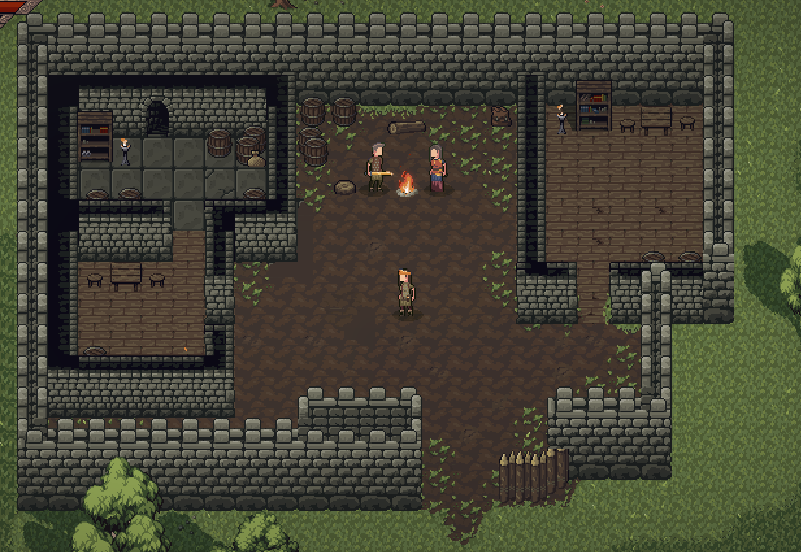
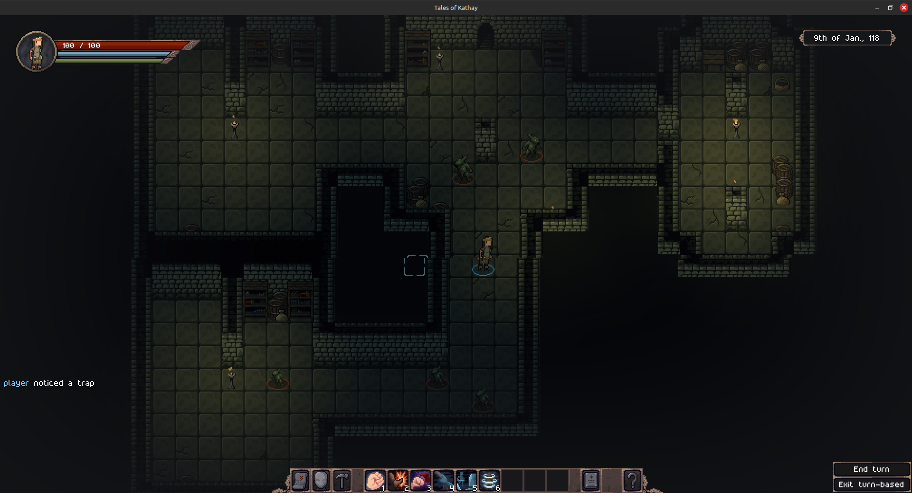
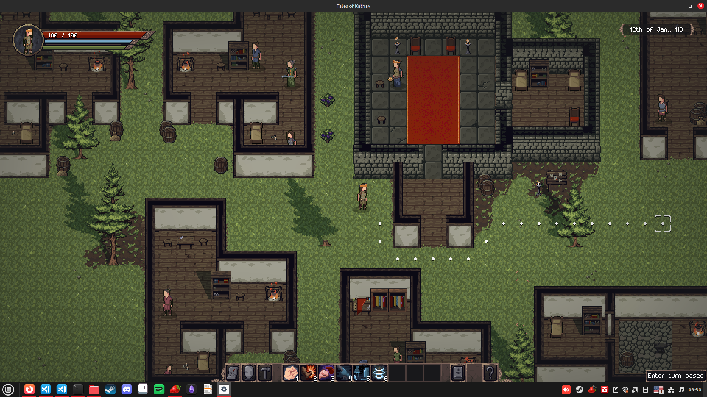

## Important update about the Open Alpha

I'll be ending the Open Alpha for Tales of Kathay shortly, transitioning to a Closed Alpha exclusive for [Patreon](https://www.patreon.com/cw/Jouwee) supporters.

You'll still be able to play a demo version of the game for free on Itch, with limited options for world size and playthrough duration.

The game will still be updated regularly, but the access will be restricted to Patreon supporters of any paid tier.

To continue playing the updated versions of Tales of Kathay, consider becoming a member on [Patreon](https://www.patreon.com/cw/Jouwee). **I still have a few updates planned for the Open Alpha, so you can wait a bit before becoming a member.**

If you have donated through Itch, I'll figure out a way for you to still have access to the updated Alpha versions.

-----------

Hey everyone!

The Open Alpha 0.13.0 is now available for [download on Itch.io](https://jouwee.itch.io/tales-of-kathay)!

In this update, the focus was in creating some more interesting and proper dungeons, while following the principles of world simulation of the game.

To accomplish this, I've added a two-step generation for dungeons. First, large cities spawn Forts around their cities, which eventually become abandoned. Then, Bandits or Grokkers take over these forts, turning them into the dungeons.

The system required a lot of rework of the structure & site system, but is now flexible enough to easily allow new types of structures to be taken over (e.g. Temples, Cities, etc), and other creature to take over (ghosts, necromancers, etc).

# New Fort

The new Fort site is spawned when a city has a large number of guards in the city itself. It then constructs the fort and moves said guards to the Fort.

Forts currently have 2 surface template, and a few pieces for the underground dungeon that are randomly placed.

# Fort Takeover & Structure Rework

When some creature decide to spawn a new site (Currently Grokkers and Bandits), they first look for a suitable abandoned site to take over instead.

For the take over to feel natural, and not just a replacement of the guards with the Bandits, three steps are taken.

First, the structure is aged based on how long it was abandoned for. Walls crack and break, furniture crumbles.

Second, previous "rooms" that were used by the guards (say a bedroom, or a storage area) are replaced by rooms used by the creature taking over. Bedrooms might be replaced by bedrolls, or just junk the grokkers left behind.

And finally, a layer of decor is placed based on the creature taking over, the same decord that would be used on a brand new camp.

# New city structures

I also used this opportunity to rework and update all of the structures and new rooms for villages.

They now have better looking houses (although still a bit repetitive) and townhall. Some rooms of the houses are also replaced to accomodate the occupants professions.

# Patch notes

## Gameplay
- Large rework of how sites and structures are generated to allow for greater flexibility;
- Remade most town structures, such as houses and the townhall;
- Structures are now made the Structure itself with rooms inside;
- Large cities will now randomly spawn up to 2 forts nearby;
- Bandits and Grokkers can take over abandoned forts;
- You can now ask guards about nearby points of interest;
- People from existing cities can now establish new cities;
- Added loot to bandit camps;
- New object tile: Cabinet (Container);
- New object tile: Knapsack (Container);
- New object tile: Stucco Wall & Broken Stucco Wall;
- New object tile: Stone Dungeon Wall & Broken Stone Dungeon Wall;
- New object tile: Fort Stone Wall;
- New object tile: Firepit with Pot;
- Improved the action range & AoE preview;

## UI
- Chat dialog no longer shows trade option if the NPC is not a trader;
- Fixed annoying tooltips covering the content;

## Balance
- Bandit Camps are now more common;
- Rebalanced the world generation to make playable scenarios more common;

## Bugfixes
- Fixed issue where you could click through the confirmation dialog in the map;
- Fixed loading the game in turn-based mode, where NPCs got a free turn before the player;
- Loading old saves now shows a warning instead of crashing;
- Fixed modals having sub-pixel position (Caused a "blurry" effect);
- Fixed world generation placing items & NPCs beneath walls;
- Closing the game while it is saving no longer corrupts the save;
- Fixed issue where AI was using the "Cleave" action out of range;

## Modding
- New tool for creating structures (not bundled with ZIP);

[Wishlist Tales of Kathay on Steam](https://s.team/a/3939340?utm_source=website_update)

