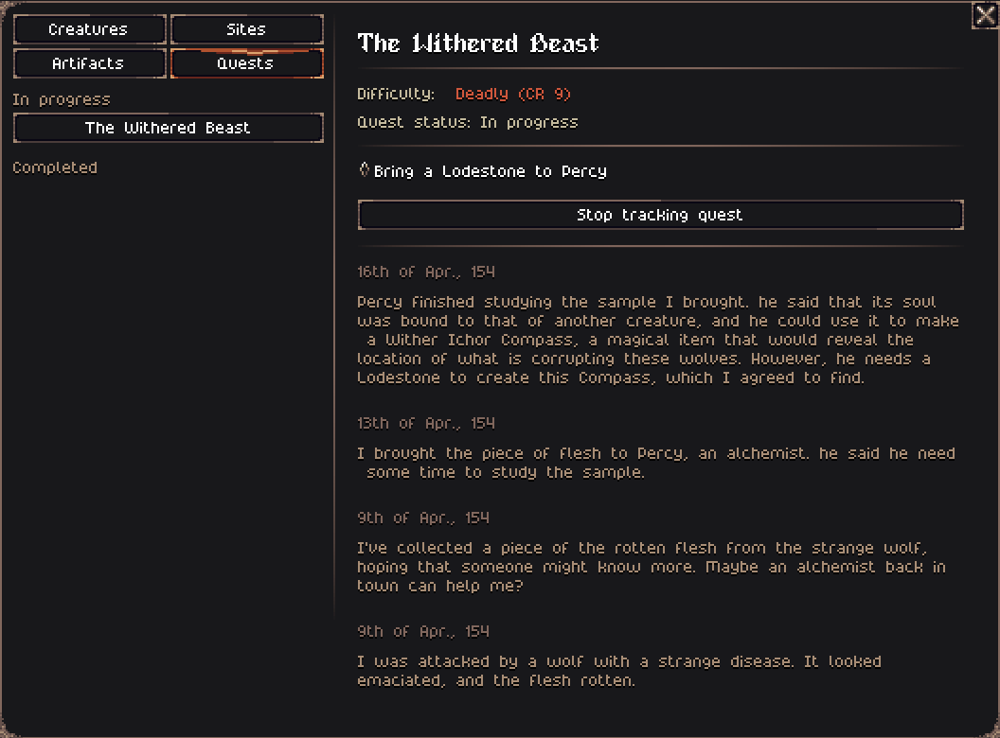
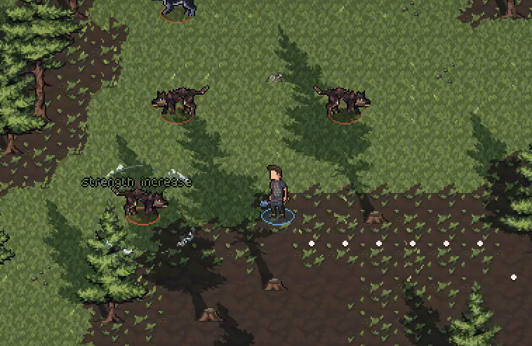
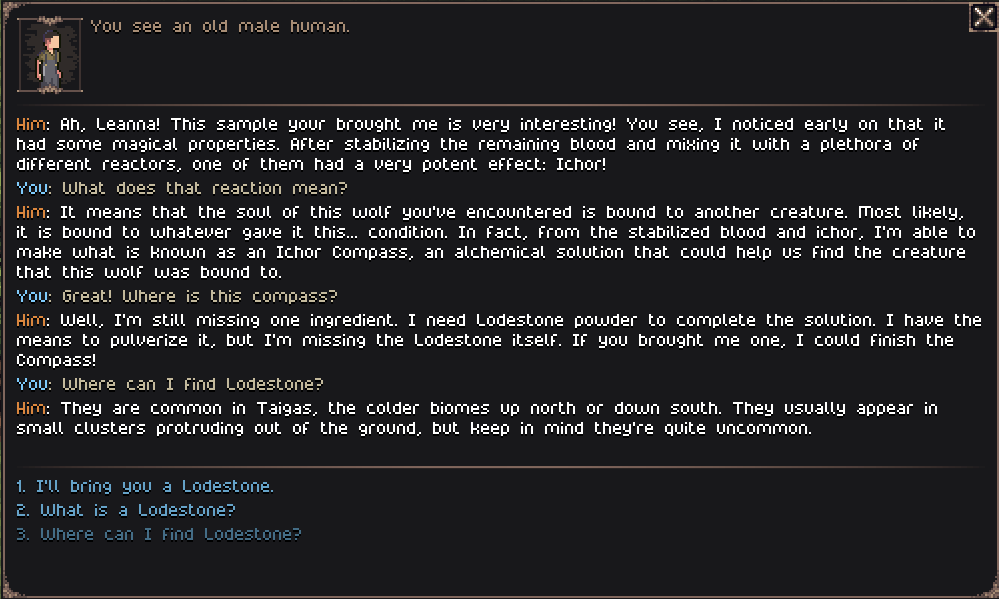

## Important update about the Open Alpha

**This will be the last update for the Open Alpha** for Tales of Kathay shortly, transitioning to a Closed Alpha exclusive for [Patreon](https://www.patreon.com/cw/Jouwee) supporters.

You'll still be able to play a demo version of the game for free on Itch, with limited options for world size and playthrough duration.

The game will still be updated regularly, but the access will be restricted to Patreon supporters of any paid tier.

To continue playing the updated versions of Tales of Kathay, consider becoming a member on [Patreon](https://www.patreon.com/cw/Jouwee). **I still have a few updates planned for the Open Alpha, so you can wait a bit before becoming a member.**

If you have donated through Itch, I'll figure out a way for you to still have access to the updated Alpha versions.

-----------

Hey everyone!

The Open Alpha 0.14.0 is now available for [download on Itch.io](https://jouwee.itch.io/tales-of-kathay)!

# Main features

- ***Revised quest system*** to allow for more flexible, intricate, and multi-staged quests;
- Added a new ***quest with a mini-boss***, designed as the end-game quest for the demo;
- Redesigned an existing, but very rare, creature as the mini-boss;

- Added a ***new enemy*** to support the new quest;

- ***Revised dialogue system*** to support more personalized and intertwined chat interactions;

- Simple interactions in game can also happen now, breathing some life into the towns;

# Patch notes

## Gameplay
- New enemy - Withered Wolf;
- New quest enemy - Withered Flesh;
- New quest enemy - Wither Ichor Compass;
- New quest enemy - Lodestone;
- New status effect - Flesh Rot (Penalty to strength and constitution);
- Varningr got new abilities and stats, balanced as a mini-boss for the current content of the game;
- Changed the lore stats of the Varningr - How long they live, how often they spawn, etc;
- New and improved quest system;
- New and improved chat system;
- Simple chat interactions can now happen in-game;
- Revised most quests (Text, dialogue, names, etc);
- New "end-game" quest (for the current end-game) that leads into the Varningr mini-boss;
- New quest for hunting the Withered Wolf enemies;
- You can now sleep in tents;

## UI
- Items with "Normal" quality now have no prefix;
- The chat screen now shows what side-effects each option might have (Mostly for quests);
- The chat screen is now usable via keyboard, with digits 0-9 to select options;
- Status texts (Damage, status effects, etc) no longer overlap when multiple are visible;
- "New quest" and "Quest completed" notifications;

## Balance
- Rebalanced most creature and quest spawns;

## Bugfixes
- Fixed the Help Hints showing the Help through modal screens;
- Fixed issue where the enemy AI would try to use an action on cooldown;
- Fixed issue where the townhall was being overriden by another building;
- Accepting a quest in the notice board now clears that quest from the screen;
- The player character no longer spawns as an NPC in the world;
- Fixed coyote sprite orientation, they're no longer constantly moonwalking;
- Fixed some worldgen rules that made the Townhall be abanadoned;
- Fixed crash when the player dies of a status effect, while being the only actor in the area;

## Modding
- Quests can be dynamically created via TOML files;
- "Plays" (Dialogues) can be dynamically created via TOML files;

[Wishlist Tales of Kathay on Steam](https://s.team/a/3939340?utm_source=website_update)

