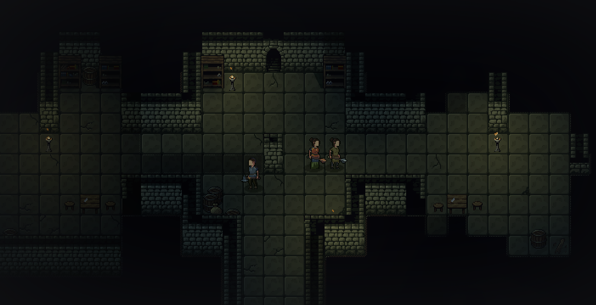
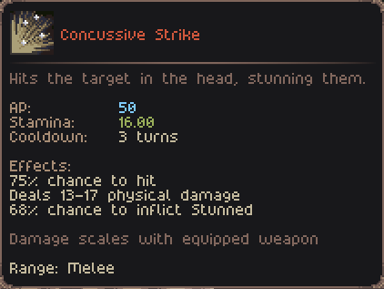
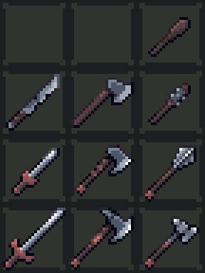

- [Play the Alpha Demo on Itch](https://jouwee.itch.io/tales-of-kathay)
- [Become a Patron and play the full release early](https://www.patreon.com/cw/Jouwee)
- [Wishlist Tales of Kathay on Steam](https://s.team/a/3939340?utm_source=website_update)

-----------

# Main features

- ***New Field of Vision*** mechanic that hides the terrain and NPCs where the player can't see;

- ***New way of inflicting Bleed and Stun*** and other effects, allowing for better weapon progression;
- ***Reworked protection and resistances***, allowing for better armor progression;

- ***Added 3 new Weapons***, the Longsword, War Axe, and Maul, completing 3 tiers for each weapon line;
- Updated several weapons stats and sprites;

- Several balance changes in the game;

# Patch notes

## Gameplay
- New "Field of Vision" mechanic;
- New "Fog of War" mechanic;
- New "Vision Distance" stat that specifies how far an NPC can see;
- Replaced NPC "aggro range" for their vision;
- Objects can now block movement and/or vision separately;
- Interacting with the towns notice board now clears the Fog of War of the whole area;
- Weapons and Actions can now have a "chance to inflict" for status effects (Such as bleed, stun, etc);
- Equipment can now chance stats, such as axes giving extra critical hit chance when equiped;
- Removed Fumble chance, instead having a % Chance to Hit;
- Reworked the sequence of checks in each attack (Hit, Dodge, Critical, etc) as to be more in line with other Roguelikes;
- New "(DamageType) Resistance" stats, that reduce that specific damage component when receiving damage;
- New "(Status) Resistance" stats, that can negate incoming status effects;
- "Protection" stat now reduces all damage types equally;
- Bludgeoning, Slashing, and Piercing damages merged into a single Physical damage type;
- "Intuition" attribute renamed to "Awareness";
- Inspect dialog updated with more information, specially for NPCs;
- Rebalanced all Weapons as to have clearer roles: Swords excel at 1v1 and focus on Bleed, Axes excel at group fights and focus on Critical Hits, and Maces focus on debuffing the enemy with Stuns;
- New "Longsword" weapon, a Tier 3 weapon in the sword line;
- "Sword" renamed to "Shortsword", and updated sprite;
- New "War Axe" weapon, a Tier 3 weapon in the axe line;
- "Axe" renamed to "Hand Axe", and updated sprite; 
- "Club" is now weaker, intended as a Tier 0 weapon, and updated sprite;
- New "Spiked Club" weapon, to serve as a Tier 1 weapon in the bludgeon line;
- "Mace" weapon has an updated sprite; 
- New "Maul" weapon, to serve as a Tier 3 weapon in the bludgeon line;
- New dynamic quests for clearing out predator dens, given by Guards;
- Added 2 more skin tones to humans (Completely randomized);

## UI
- You can now cancel a hotbar selection by pressing the number again;
- Improved the description of Skills in the Skills panel;
- New visual frame around the world map;
- Trading screen is now sorted by price;
- Added option to reload game in the Death screen;
- Quest reward is now visible in the codex;
- Crafting screen recipe list is now sorted alphabetically;

## Balance
- Rebalanced most armors stats;
- Changed the prices of most items;
- Rebalanced several Species;
- Changed the bandit gear to be worse;
- Selling items now yield slightly less money;

## Bugfixes
- Fixed issue with localization in the Inspect screen;
- Fixed the player's character spawning as a duplicate;
- Fixed perception bonus not actually being used to spot traps;
- Fixed issue where a corpse was duplicated after sleeping in the area;
- Fixed issue where more than one "chat" could happen at the same time;

