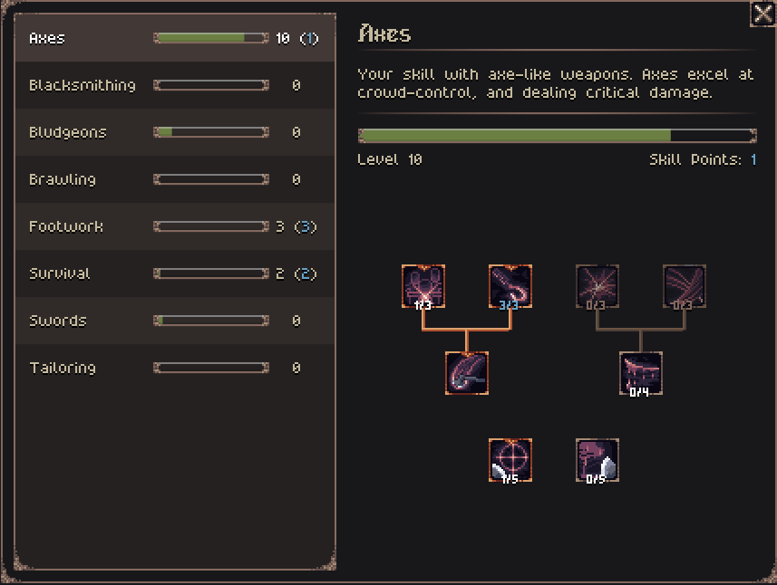
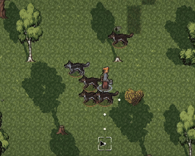

- [Play the Alpha Demo on Itch](https://jouwee.itch.io/tales-of-kathay)
- [Become a Patron and play the full release early](https://www.patreon.com/cw/Jouwee)
- [Wishlist Tales of Kathay on Steam](https://s.team/a/3939340?utm_source=website_update)

-----------

# Main features

***New Skill Tree*** system that replaces the previous milestone (linear) format. You can now choose what unlocks to prioritize, creating distinct builds along the way;

***New abilities*** for you to unlock in all the weapon skill trees. Push all enemies away, deal strikes with extra crit chance, or lunge at your enemies;

***New stats*** for block chance, counter-attack chance, bleed chance and stun chance;

***Smoother start*** for new playthroughs, revealing the starting city and making blacksmiths more common;

***New artwork*** from the incredible Marvin Blattert [@/komarca.art/](https://www.instagram.com/komarca.art/), being showcased in the main menu and the game's visual identity;

# Patch notes

## Gameplay
- Skills are now defined in unlock trees instead of the previous milestone (linear) format;
- New stat: Block chance - allows you to block incoming attacks that would otherwise hit;
- New stat: Counter chance - whenever you're attacked, you can perform a simple attack back;
- New ability: Lunge - Jump at your enemies, with a higher chance of dealing critical damage;
- New ability: Fencer's advance - Moves into an adjacent tile, and get extra block chance;
- New ability: Crowd Push - Pushes enemies in an arch away from you;
- New ability: Hook In - Pulls an enemy closer with the hook of your axe;
- Changed Mutilate action to deal extra critical damage instead of Bleeding and Stunned;
- Crafting recipes now require specific unlocks instead of a level;
- Removed "One-handed-fighting" skills;
- Renamed "Sword Fighting" skill to "Swords";
- Renamed "Axe Fighting" skill to "Axes";
- Renamed "Mace Fighting" skill to "Bludgeons";
- Renamed "Hand-to-hand Fighting" skill to "Brawling";
- Renamed "Combat maneuvering" skill to "Footwork";
- Grokker Chiefs can now spawn with a slightly better weapon;

## UI
- Added new logo and art on the main menu;
- Added new help topic for skills;
- Added new help topic for crafting;
- You can now see the traders of a city when hovering over it in the map;

## Balance
- Increased the speed which you level up;
- Reduced range of encounter generation from 7 world tiles to 6;
- The starting city is always revealed;
- Increased volume of blacksmiths across the world;

## Modding
- New "Loadout" resource that defines what equipment NPCs will wear;

## Bugfixes
- Fixed issue where the player could start with a full inventory if they inherited it from their parents;
- Fixed issue where traders could have no inventory;
- Quitting the game now waits for any save subroutine to avoid save mismatches;

