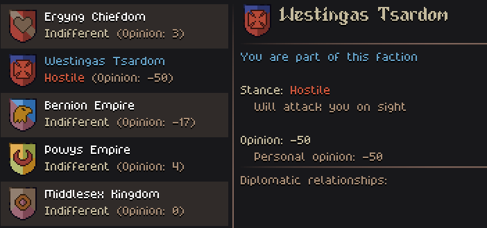

- [Join the Discord](https://discord.gg/ZaDaPD9Uh)
- [Play the Alpha Demo on Itch](https://jouwee.itch.io/tales-of-kathay)
- [Become a Patron and play the full release early](https://www.patreon.com/cw/Jouwee)
- [Wishlist Tales of Kathay on Steam](https://s.team/a/3939340?utm_source=website_update)

-----------

# Main features

***New Faction System*** creates a new territory-bound entity in the game, that governs over several villages. These factions have diplomatic interactions between them, fight over territory, and can declare war and peace;

***New Ongoing Battles*** that you, the player, can jump in to try to sway the battle in favor of your allied faction. This includes the already existing bandit and grokker attacks;

***Faction opinion*** allows you to strengthen your relationship with factions, and get perks such as trader discounts;

***Better investigating AI***: NPCs that are investigating will now look around for a bit, then give up;

# Patch notes

## Gameplay
- Villages & Tribes now belong to the new Factions;
- Sites exert influence on the nearby region, blocking other factions from settling there;
- Factions have opinions of eachother, that can raise and lower with world events;
- Empire-type factions can declare war on each other, conquer cities, and negotiate peace;
- Factions have generated names and heraldry (Shields and emblems);
- Ongoing battles of the world now appear in the world map, and you as the player can jump in a battle to sway it's outcome;
- Factions have a more detailed opinion of the player, that rises when you help them through quests or battles, and lowers when you steal or attack them;
- "Friendly" factions have lower prices at all traders;
- NPCs that are now investigating (? over their head) will look around for a bit, then give up. This will no longer prevent exiting turn-based mode;

## UI
- Tweaked the aggro and investigating marker position (!! and ?);
- Added some help topics for the Look key (Alt) and butchering mechanic;
- In the crafting screen, added ingredient counters ("?/N") in all relevant places;
- Added the appicon;
- In the Codex, the current tracked quest now has a small indicator on the quest list;
- Quest markers and player marker in the world map are now animated;
- In the trade screen, the item tooltip also is shown when hovering over the name;
- Added trader signs outside of shops to make them stand out more;

## Balance
- Reduced crafting cost of the "Blacksmithing Hammer" from 3 ingots to just 1 ingot;
- The skills "Cleave" and "Crowd Push" switched places in the Axes skill tree. Cleave takes 3 unlock points, and was a requirement for 2 other skills, meaning that you had to save up too much if you wanted the extra skills;
- Increased the enemy turn speed slightly (Soon will be an option);
- Rebalanced quests CRs a little bit. They will now be considered slightly easier than they previsouly were;
- Removed range restriction from "Inspect" action. If you can see it, you can inspect it;
- Removed some very generic quest names (e.g. "Caution!"), making it clearer what you're fighting;

## Modding
- Faction simulation uses a new format I'm trying out, allowing you to create events in the "faction_history_events.toml";
- World events were also moved to "event_blueprints.toml" to allow editing;

## Bugfixes
- Fixed the missing description of the Spiked Club item;
- Fixed Small Knife not providing the "Strike" action;
- Fixed axes not providing the "Chop" action;
- Fixed random crash when opening the world map;
- Fixed Dodge Chance not being affected by the Agility stat;
- Fixed some quirks with the mouse controls that made them feel slightly unresponsive;
- "Small Knife" sprite now correctly colors the sprite in accordance to the material;

