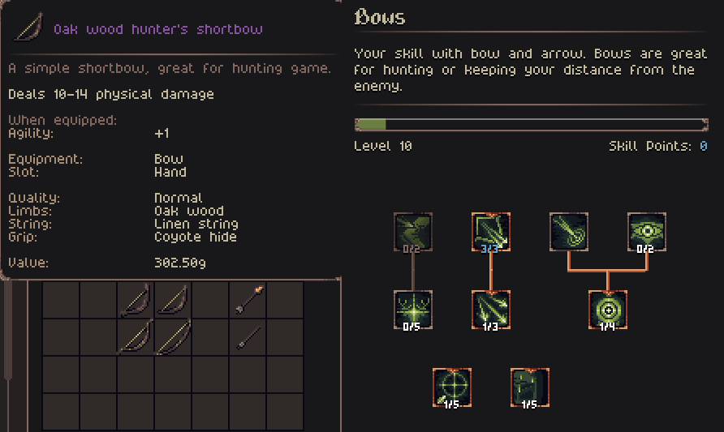
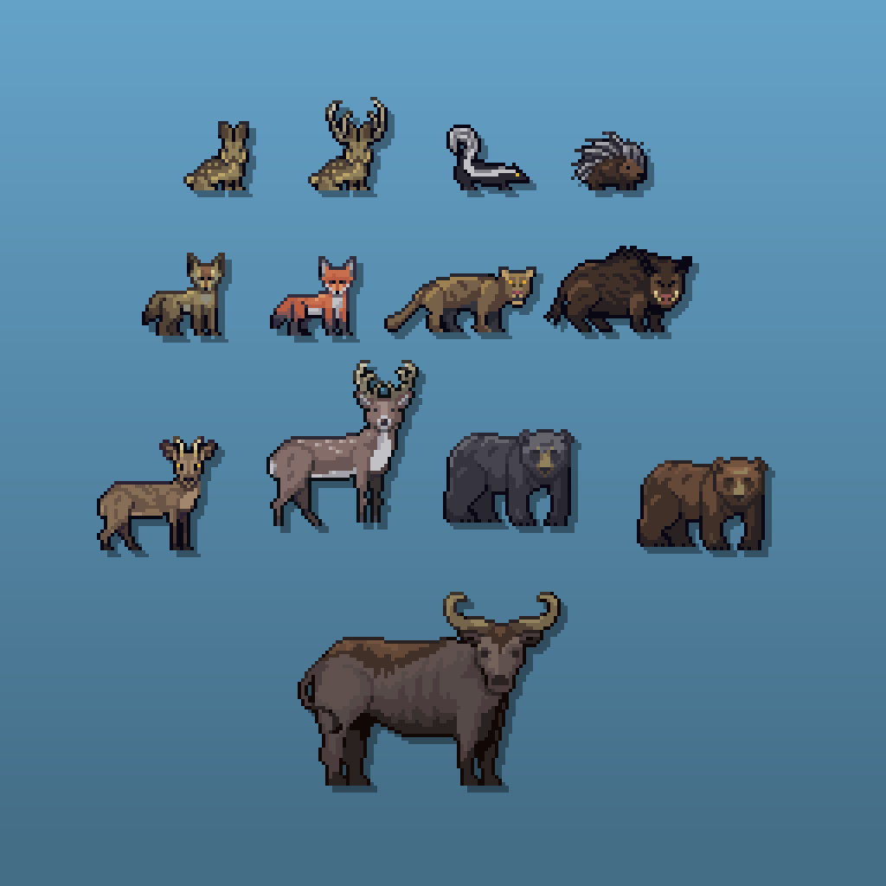
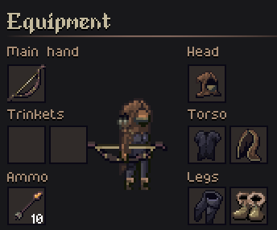

- [Join the Discord](https://discord.gg/ZaDaPD9Uh)
- [Play the Alpha Demo on Itch](https://jouwee.itch.io/tales-of-kathay)
- [Become a Patron and play the full release early](https://www.patreon.com/cw/Jouwee)
- [Wishlist Tales of Kathay on Steam](https://s.team/a/3939340?utm_source=website_update)

-----------

# Main features

***New Bow weapon class***, with 4 different bows, 2 ammo types, and a new skill tree with 9 new skills to choose from;

***11 new animal species*** added for your hunter needs, and some of the existing ones got some new abilities too;

***New Hunter and Tracker Armor*** that provides bonuses versus animals, and is in general great for bow play;

***New Hunter NPC*** that sells all of the new equipment, and has a few new quests too;

# Patch notes

## Gameplay

- AP recovered per turn is now a stat that changes with injuries;
- You AP can carry over between turns up to 125;
- New weapon: "Carved Shortbow";
- New weapon: "Hunter's Shortbow";
- New weapon: "Recurve Bow";
- New weapon: "Longbow";
- New armor: "Hunter Tunic";
- New armor: "Hunter Hood";
- New armor: "Hunter Leggings";
- New armor: "Tracker Cloak";
- New armor: "Tracker Hood";
- New armor: "Tracker Boots";
- New ammunition: "Carved Arrow";
- New ammunition: "Metalhead Arrow";
- New item: "Thread Spool";
- New skill tree: "Bows";
- New bow skill: "Bow Precision" - Increases accuracy;
- New bow skill: "Bow Conditioning" - Decreases stamina use;
- New bow skill: "Quick Shot" - Low AP cost shot;
- New bow skill: "Barrage" - Multi-target shot;
- New bow skill: "Target Practice" - Reduces accuracy drop with distance;
- New bow skill: "Steady Shot" - High AP shot with high chance of hitting;
- New bow skill: "Keen Eye" - Increases vision;
- New bow skill: "Hunter's Instinct" - More damage to animals;
- New bow skill: "Maimimg Shot" - Shot that reduces movement speed;
- New survival skill: "Improvised ammo" - Allows you to craft Carved Arrows;
- New animal species: "Hare";
- New animal species: "Boar";
- New animal species: "Goral";
- New animal species: "Black bear";
- New animal species: "Fox";
- New animal species: "Deer";
- New animal species: "Mountain Lion";
- New animal species: "Skunk";
- New animal species: "Porcupine";
- New animal species: "Jackalope" (Very rare);
- New animal species: "Auroch" (Very rare);
- New Hunter NPC profession, that sells pelts, bows and arrows;
- "Bear" renamed to "Brown bear";
- New ability for some animals: "Ram";
- New ability for some animals: "Claw";
- New ability for wolves: "Warning Howl";
- 2 new quests given by the Hunter NPC;
- It's now required to have a knife in your inventory in order to butcher corpses;
- Settings screen now allow changing some video & gameplay settings;
- Settings screen acessible via the main menu;
- Not all animals are hostile anymore. Some have only a chance of being hostile;
- All wildlife is not persistent in the world, and should be more common;
- NPCs now wander around their spawn point, visiting points of interest;
- When outside of combat, you can now path to an action and perform that action with a single click;
- The default video mode is now fullscreen;
- When you visit a PoI, it is now revealed on the map and in the codex;
- Now song "Unworthy" by Guilherme Bernardes William;
- Actions now have different priorities for "smart use" (Single Click) while in combat and outside of it;

## UI
- Improved the tooltips for several items passive effects;
- Gold in inventory now has a small icon to make it more visible;
- When you press a dialog key (E for Inventory, J for Codex, etc) with another dialog open, that dialog is closed and the new one opens;
- Fixed some weird item material naming (e.g "Coyote Pants" becomes "Coyote Hide Pants");
- You can now scroll by dragging the scroll bar;
- Added a small skull marker on creatures whose Challenge Rating is higher than yours;
- Added option in the load menu to delete saves;
- Increased the character portrait size in the inventory screen;
- Replaced "Buy All" option in traders for a "Buy 10";

## Modding
- It is now possible to define history actions for creatures in the "creature_history_event.toml" file;

## Bugfixes
- Confirming the "Split Stack" dialog no longer closes the inventory;
- Fixed some material properties not being applied to items;

