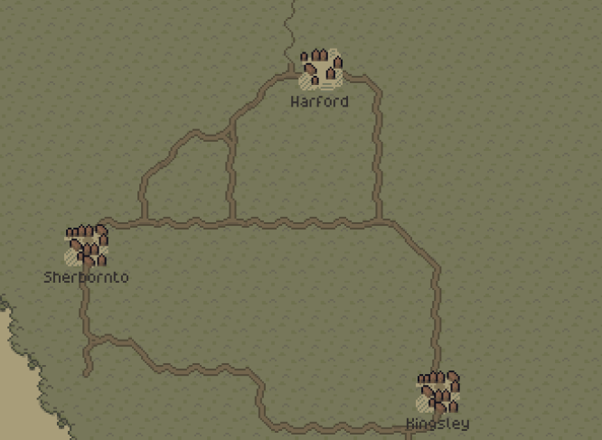

- [Join the Discord](https://discord.gg/ZaDaPD9Uh)
- [Play the Alpha Demo on Itch](https://jouwee.itch.io/tales-of-kathay)
- [Become a Patron and play the full release early](https://www.patreon.com/cw/Jouwee)
- [Wishlist Tales of Kathay on Steam](https://s.team/a/3939340?utm_source=website_update)

-----------

# Main features

***New Road Generation***: roads will now spawn connecting different villages and other sites;

***New traveling system***: Fast-travel has been removed from the game, and replaced with a travelling system, that allows you to move to any area in the world tile, as long as it's connected to a major or secondary road;

***Vision and fog of war on the worldmap***: you will no longer have the whole map revealed when you start the game, but only a small selection of closeby villages. You can reveal this map by exploring the area on foot or via roads, or also by asking directions to guards;

# Patch notes

## Gameplay
- New travel scene that allows the player to move around the world using major and secondary roads;
- You can no longer fast-travel to discovered locations, unless they're connected to a road;
- New fog and vision area in the world map, that must be revealed as you play;
- Not all villages are revealed anymore at the start of a game;
- Guards can now tell you about distance villages;
- Roads now generate connecting villages and other site types;
- Roads allow you to travel using the overworld map;
- Roads are generated when you enter an area. Even if you don't use the overworld map for traveling, they'll show you the way to points of interest;
- Roads slowly degrade if not used;
- Changed dirt footstep sound effect;
- Added 4 new random encounters in the wilderness;

## Visuals
- Added branches, rocks, fallen logs, and flowers to decorate the wilderness;
- Increased tree density in Forest and Taiga biomes;

## UI
- Brought back the option to "Buy All" and "Sell All", while keeping the x10 option;
- Quest markers now show the direction to the quest area, if outside of current area;
- Added sound effect to when you open or close a map;
- Removed unused health stats (Manipulation, Conciousness, and Movement);
- You can now zoom in and out in all maps;
- All maps can now be panned with the mouse;
- Option to show/hide faction territories in maps;
- Option to show/hide a grid overlay in maps;

## Balancing
- Prey will no longer randomly attack you, unless you attack first;
- Fixed Strength attribute giving way too much Melee Damage Bonus;

## Modding

## Bugfixes
- Fixed the "Location discovered" notification triggering multiple times in some cases;
- Fixed the player spawning inside a tree or other object when transitioning between areas;
- Fixed action tooltips not reflecting the "Melee Damage Bonus" stat;
- Fixed formatting of the "Perception bonus" stat;
- Fixed foxes showing up in predator den quests, as they usually flee instead of fighting;
- Fixed the priority of some actions (Was prioritizing picking up an item istead of shooting a bow, for example);
- Fixed some bugs with the context menu not closing when expected;
