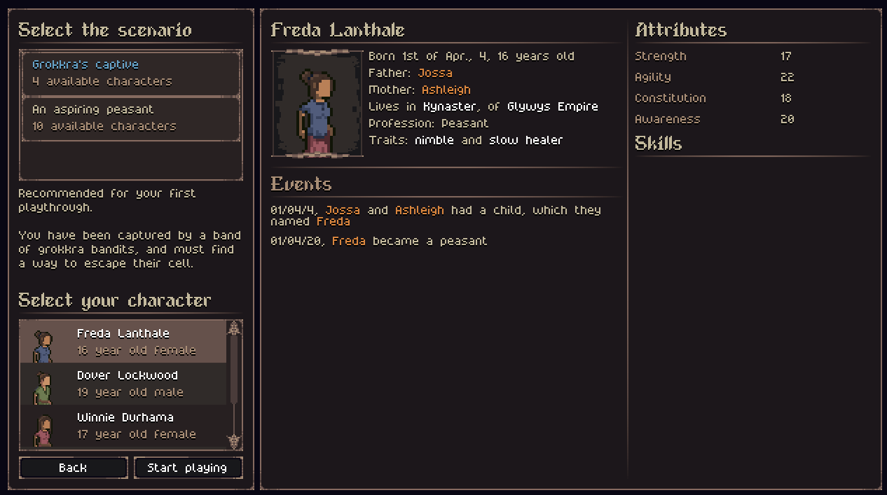
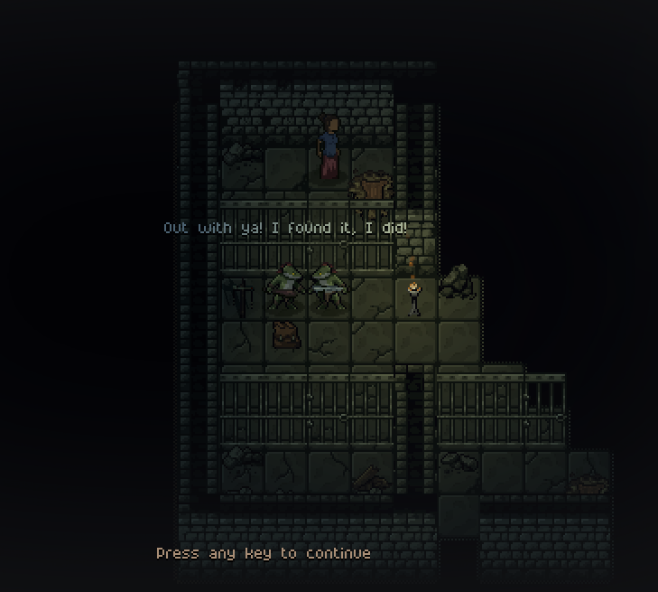

- **[Join the Playtest via Steam](https://s.team/a/3939340?utm_source=website_update)**
- [Join the Discord](https://discord.gg/BHWJMftS9r)
- [Become a Patron and play the full release early](https://www.patreon.com/cw/Jouwee)

-----------

# Main features

***Scenarios***: when starting a new game, you can now choose between different scenarios to play the game. The scenario specifies the starting situation your character will find theirself;

***New dungeons & Cutscenes***: New dungeons and a cutscene system have been added to the game in support of the scenarios. Predator dens and bandit camps got some new underground areas as well;

***Doors and gold***: villages and dungeons will now have doors separating the different areas. In some cases, these doors might require a key to be opened. Gold coins will now also spawn on different dungeons as loot;

# Patch notes

## Gameplay
- You can now select diferent scenarios when starting a new character;
- New scenario "An Aspiring Peasant", equivalent to the classic start;
- New scenario "Grokkra's Captive", a new dungeon intended as an introduction to the game;
- Predator dens and bandit camps now have an underground dungeon section;
- Village buildings now have doors;
- New decorations for undeground areas (caves & dungeons);
- New key item, currently used only in the starting dungeon;
- New cutscene system;
- Gold coins can now spawn on lootable containers in bandit camps and grokkra camps;
- The AI can use doors;

## Visuals
- Items on the ground now have a small glint;
- Added sound effect to picking up items;
- Campfires and torches now emit particles;
- Consuming items now have different sound effects for eating and drinking;

## UI
- Reworked the travel UI to better convery how the mechanic works;
- When opening the skills screen, it will automatically select the skill with the most unspent skill points;

## Balancing
- Rebalanced the loot of most sites and encounters;
- HP Healing is now significantly faster, leading to better dungeon-crawling (it is feasable to heal between fights);
- Traveling heals you according to the travel time;
- Decreased villages faction influence (smaller territories);
- You can now travel to tiles with paths (minor roads);
- Grokker tribes spawn with 10 grokkra instead of 5;
- The first few level-ups of any skill are now significantly faster;
- Cougar now deals more damage and has more HP;
- Decreased CR of most multi-enemy fights;

## Modding

## Bugfixes
- Fixed issue where the game was very dark in some graphics cards;
- Fixed issue where traveling to an area revealed all the fog of war;
- Fixed some spots where text was overflowing and showing a scroll bar;
- Fixed issue where you could open some screens, such as the inventory, behind the "Loot Container" dialog;
- Fixed issue where you could spot traps through walls;
- Fixed damaging traps not dealing damage;
- Tanning Rack no longer blocks vision;
- Fixed some typos;
- Fixed some cursor messages showing the internal name ("NotEnoughAP" instead of "Not enough AP");
- Fixed issue where you could equip items in the wrong slot;
- Fixed crash when reaching the max level of a skill;
- Fixed crash when starting a new character after death;
- Fixed crash when you walk out of the edge of the map, it now shows a message;
- Fixed some objects "floating" in unrevealed areas;
- Fixed action names being shown even in tiles you haven't revealed;
- You can no longer inspect outside of your FOV;
- Fixed conflict when you had 2 quests of the same type to be delivering, allowing only the first one to be delivered;
- Sling weapon now tells you it's damage;
- Fixed chat auto-scroll when selecting an options;
- Fixed encounters being created very far away from the village;
- Fixed some items being uncapitalized in the tooltip;
- Fixed quest marker showing in underground areas;
