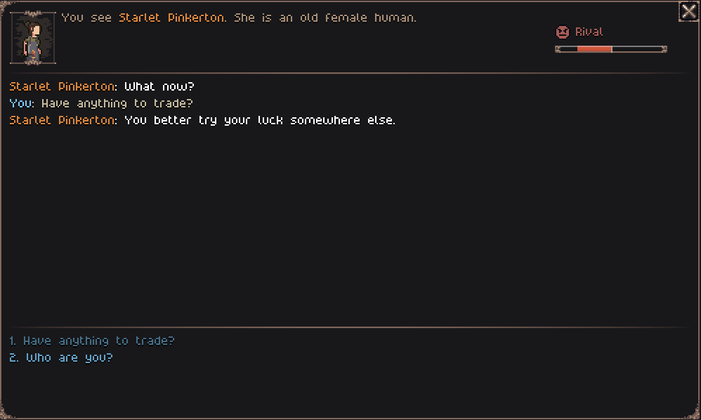
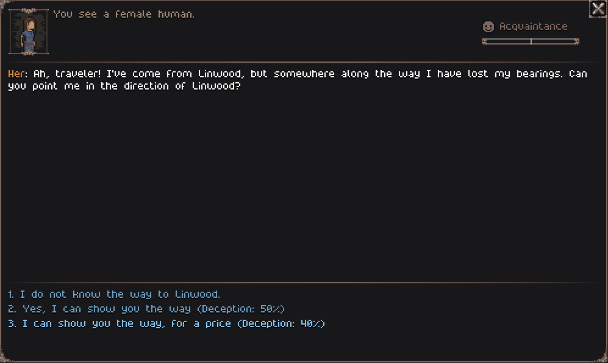

- [Wishlist on Steam](https://s.team/a/3939340?utm_source=website_update)
- [Join the Discord](https://discord.gg/BHWJMftS9r)
- [Become a Patron and play the full release early](https://www.patreon.com/cw/Jouwee)

-----------

# Main features

***New personality traits*** that direct how NPCs interact with each other. There are in total 12 personality traits that have unique dialogue choices, both for NPCs and for the player;

***New personal opinions and stances***: Every character in the world now has different opinions of other characters. Befriend NPCs to unlock new dialogue and other bonuses, or risk creating a Rival that will make your life difficult;

***Persuasion and Deception***: Use your social skills to attempt to get a better outcome for dialogue, or make things worse if you fail. A new Charisma attribute dictactes how likely you are to succeed;

# Patch notes

## Gameplay
- New Charisma attribute;
- New "¨Perception Bonus" stat;
- New "Deception Bonus" stat;
- Some dialogue choices can now do "skill checks", random rolls that define if the output is sucessfull or not;
- NPCs now have opinions towards the player an other NPCs;
- 12 new "personality" type traits;
- Changed trait selection to always include one personality trait, one strength, and one weakness. Rarely, they can have two of each;
- Completing quests, attacking NPCs, and some dialogue choices affects the NPC's opinion of you;
- Friendly NPCs might offer discounts, while Rival NPCs will have worst prices, or even deny service;
- Dialogue choices vary depending on NPC's personality and stance towards the player;
- New status effects that chance according to your current stamina: "Out of breath", "Fatigued" and "Exhausted";
- Inventory now has infinite slots;
- New encumbrance system: Each item has an encumbrance score. Carrying too much have negative side-effects;
- New encumbrance statuses: "Encumbered", "Heavily Encumbered" and "Over Encumbered";
- Gold values are now round numbers;

## Visuals
- 6 more hairstyles, 3 for males and 3 for females;

## UI
- Revised codex page for sites;
- Revised codex page for creatures;
- New settings option to select Audio Ouput Device;
- Added HUD tooltips for each stat;
- Alt now shows the name of interactibles and people;
- Context menu (Right click) now shows the reason some actions can't be performed, for clarity;
- Shift+Space shortcut to switch turnmodes;
- Skill unlocks tell you if they're passive, active or recipes;
- You can press Alt when hovering an equippable item to compare it to your current equipment;

## Balancing
- Fovrea's shrine spawns only in forests and taigas;
- "Grokkra's Captive" enemies have been very slightly nerfed;
- Reduced the value of "wolf bone" material;

## Modding
- Status effects are now defined via resource files;

## Bugfixes
- Removed "Pickup" action priority over "Bow shot";
- You can no longer close a door when an enemy is standing on it;
- Removed quick-use priority from "Close" action;
- Fixed crash when editing the seed in the "New world" screen;
- Fixed village house layout with a hole in the wall;
- Fixed crash that could happen when an actor was killed while saying something;
- Fixed "?" tooltips while hovering over stats;
- Fixed grokkers not being bandits, and therefore not having weapons;