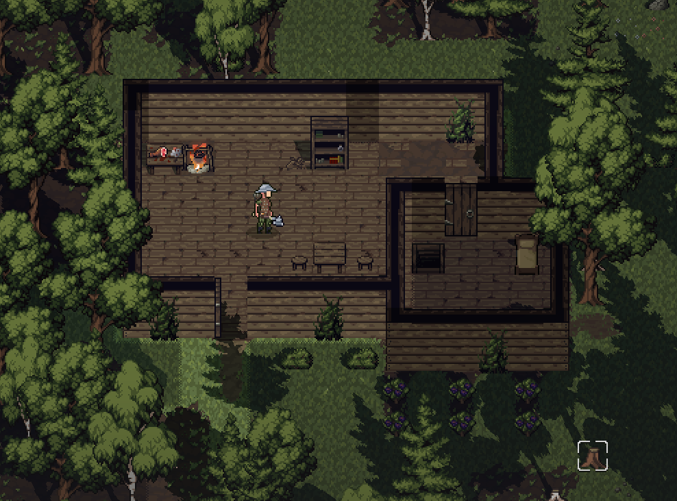
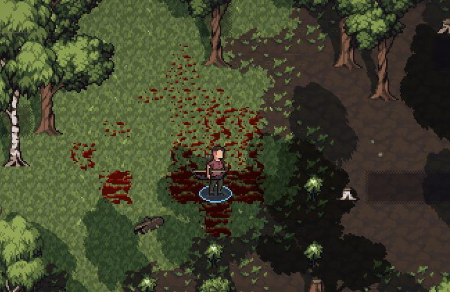

- [Wishlist on Steam](https://s.team/a/3939340?utm_source=website_update)
- [Join the Discord](https://discord.gg/BHWJMftS9r)
- [Become a Patron and play the full release early](https://www.patreon.com/cw/Jouwee)

-----------

# Main features

***New high tier biome: Primeval forest***. High tier biomes spawn in medium and small pockets around the world, and provide higher level challenges and rewards to the player;

***New quest and enemy type*** in the primeval forest. Without spoiling much, you can find the quest in towns close to Primeval Forests, and you might find a little hut while exploring;

***Blood surfaces*** now spawn when creatures are bleeding, take critical damage, or die. Blood accumulate and evaporate over time, and if you're standing in enough blood, you might get the "Slippery Surface" debuff;

***New "Lost in the wilderness" scenario***: Start in the middle of the wilderness, and use your wits to survive and find your way back home. New improvised tools and weapons, and a new "Crafting" skill tree come along to make this journey possible;

# Patch notes

## Gameplay
- New tier 2 biome: "Primeval Forest"
- New higher tier biome generation;
- Giant Spiders now spawn in the Primeval Forest;
- New scenario: "Missing in the wilderness";
- New item: "Flint";
- New item / crafting: "Flint knife";
- New item / crafting: "Flint axe";
- New item / crafting: "Bone club";
- New item / crafting: "Bone arrow";
- New item / crafting: "Flint arrow";
- You can now pick-up fallen logs;
- New skill tree: "Crafting";
- Carved arrows moved from "Survival" skill tree to "Crafting" skill tree;
- All bows moved from "Blacksmithing" skill tree to "Crafting" skill tree;
- You can now configure your keymapping under settings;
- Changed default "Inventory" key to from "E" to "I";
- New action: "Dash", unlockable under the Footwork skill tree;
- New action: "Shove", always available;
- New action: "Excuse me", always available;
- Upon starting a new game, your family and friends location and events are revealed in the codex;
- New spell and spellbook: "Vine Snare";
- New spell and spellbook: "Create Thorns";
- New spell and spellbook: "Toxic Ray";
- New quest and high level enemy in the Primeval forest;
- 2 new materials from the new enemy;
- Bleeding, critical hits, and death now create blood on the ground, that accumulate and dissipate over time;
- If you're stepping on deep enough bleed, you get a "Slippery Surface" debuff;
- Changed a bit how the keyboard movement works, improving the feeling of it;
- You can now move diagonally with WASD by holding two keys at once;
- You can now click anywhere outside of the current area to exit it, not just at the border chevrons;

## Visuals & Atmosphere
- New battle music;
- New fast travel music;

## UI
- Some help topics show at more opportune times;
- Tooltip for item stacks now show the stack's total value and encumbrance, along with the individual item values;
- Untracked quests now show up on the map;
- Added option to craft 5x and 10x in the crafting screen;
- Codex dialog now shows the current site for a creature, if known;
- You can see ongoing battles from further away on the map, in the form of smoke;

## Balancing
- A NPC opinion of you now affect your persuasion roll chances;
- Increased the range of all levels of the "Lunge" ability;
- Blacksmiths produce ingots more often;
- Reduced herb spawning by about half;
- Coyotes now give small haunches instead of meat;
- Base stamina regen increased from 1 to 2 per turn;

## Modding

## Bugfixes
- Fixed some dialogues not triggering properly;
- Fixed items in inventory going to the top when you drag and drop something on top of it;
- Fixed cities becoming independent of themselves;
- Fixed bandit camps spawning right next to eachother instead of joining together;
- Fixed character select screen showing base species attributes, not considering the character's traits;
- Fixed issue where you could click the death screen buttons before they were even visible;
- Fixed fathers having children even after they died;
- Fixed some soft-lockable steps from the "Withered Beast" quest;
