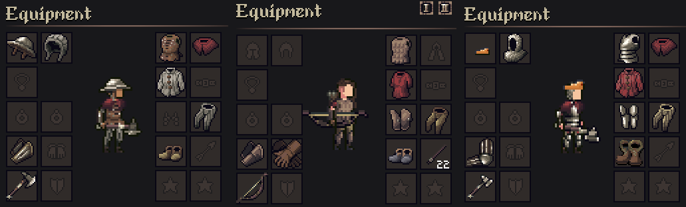
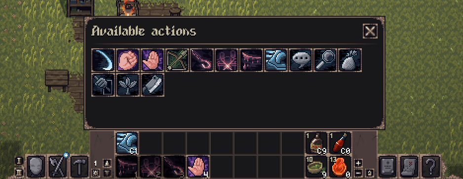

- [Wishlist on Steam](https://s.team/a/3939340?utm_source=website_update)
- [Join the Discord](https://discord.gg/BHWJMftS9r)
- [Become a Patron and play the full release early](https://www.patreon.com/cw/Jouwee)

-----------

# Main features

***New armor slots and equipment***. The number of slots for armor has been increased to 11, and there's 15 new armor pieces that allow you to create way more personalized loadouts. Most old armor has been redrawn as well;

***Hotbar management***. You can now reorder items in the hotbar, change the number of rows, and add consumables to the hotbar;

***Weapon sets***. With a belt, hold up to two different weapon sets, and quickly switch between them with a single button;

# Patch notes

## Gameplay
- Items in the hotbar are now sortable, and are saved;
- You can choose between 1 and 4 rows for the hotbar;
- You can add consumables to the hotbar;
- Hotbar has 5 pages;
- You can drag skills from the skills menu into the hotbar;
- Reworked armor slots, increasing their number to 11 slots;
- 15 new armor and clothing pieces, all craftable;
- Updated the art and stats of most old armor pieces;
- Reviewed and updated the colors of most materials;
- Blacksmithing, tailoring and crafting skills now have "milestones" that make it clearer how they affect the quality of created items;
- The chance for each quality is now shown when crafting an item;
- You can now have 2 weapon sets, and can switch between them by pressing R or using the buttons in the hotbar;

## UI
- Most basic dialogs (Inventory, Codex, etc) don't consume clicks in the game anymore;
- Codex opens in the quests page by default;
- Skill tree items that unlock recipes now say how many recipes they'll unlock;

## Balancing
- Rebalanced the intro dungeon to make it slightly easier;

## Modding

## Bugfixes
- Fixed big performance hit when computing pathing to actions;
- Fixed butchering help showing in the starting dungeon;
- Fixed shadow overflow on the HUD;
- Fixed villagers having kids way too often (sometimes more than once per month);
- Fixed material damage bonus beign applied twice;
- Fixed inconsistencies between action tooltip and actual dealt damage;
- Fixed forest hag not having the correct name;
- Fixed scroll reseting on character selection screen;
- Fixed issue where the inventory grid "lost" a column sometimes;
- Keyboard movement is now as fast as mouse movement;